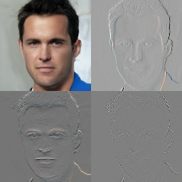

# Cascaded Wavelet Diffusion

Implementation of [Wavelet Score-Based Generative Modeling](https://openreview.net/pdf?id=xZmjH3Pm2BK) by Guth et al.

  <table>
    <tr>
      <td align="center">
        <b>32x32</b> 
        
      </td>
      <td align="center">
        <b>64x64</b> 
        
      </td>
      <td align="center">
        <b>128x128</b> 
        
      </td>
      <td align="center">
        <b>256x256</b> 
        
      </td>
    </tr>
  </table>

